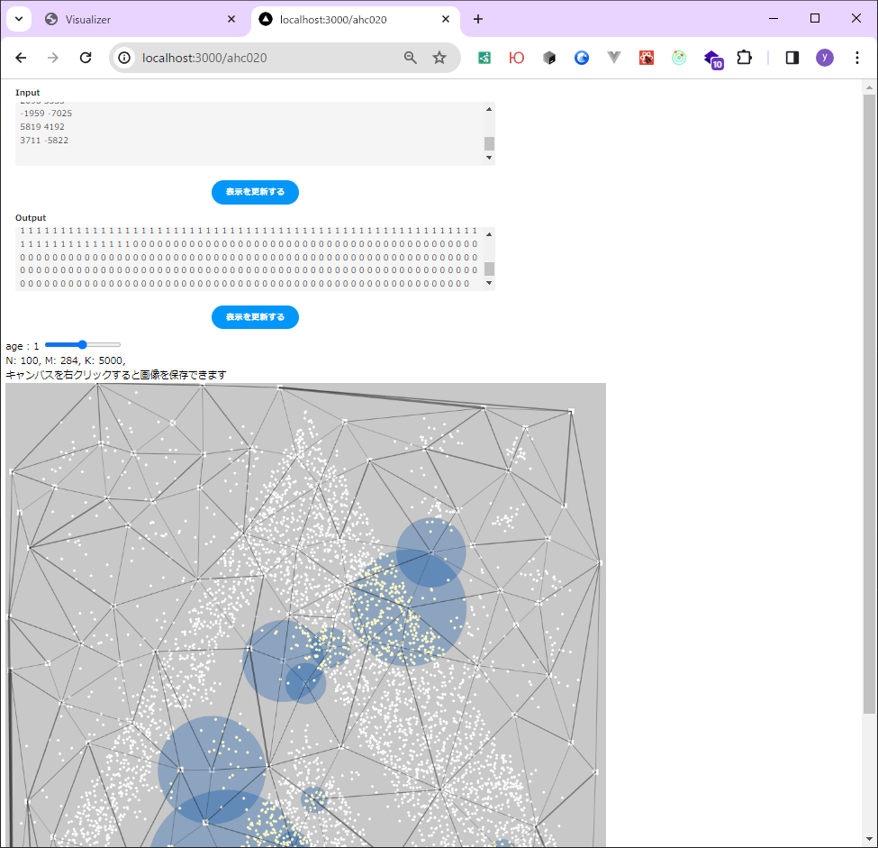

# AHC-p5-Visualizer

AtCoder Heuristic Contest で利用するVisualizerのp5.js実装 (実装途中)


## 動かし方

```shell
npm install
```

```shell
npm run dev
```

ブラウザで以下のURLにアクセスしてください http://localhost:3000/ahc020




## 内容

Next.js + p5.js + TypeScript で実装されています。


## 補足

サンプルとして実装されているものは、過去のAHCのVisualizerの実装をTypeScriptで実装し直したものになります。

AHC020(ALGO ARTIS プログラミングコンテスト2023) :
- https://img.atcoder.jp/ahc020/db611066.html?lang=ja
- https://atcoder.jp/contests/ahc020


